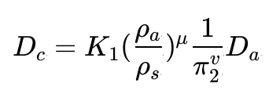

# Page

#### Page 1: Asteroid Impact with the Ground

The kinetic energy of the asteroid is:

<figure><figcaption></figcaption></figure>

Where $$D_a​$$, $$ρ_2​$$, $$V_2​$$, ρma are the diameter, density, velocity, and mass of the asteroid. This energy is what excavates, melts, vaporizes, and launches the ground material.

The density of the ground is

$$ρs​$$, and the energy transfer depends on the ratio:

<figure><figcaption></figcaption></figure>

Through dimensional analysis, the asteroid's variables can be related to g, which affects the crater's size:

<figure><figcaption></figcaption></figure>

This

$$π_2​$$ is known as a "pi-group".

The initial crater diameter, Dc, is calculated with an empirical law from experiments:

<figure><figcaption></figcaption></figure>

The typical experimental constants for impacts against the Earth are

$$K1​≈1,μ≈0.55,v≈0.17$$.

Craters tend to collapse and obtain a final diameter $$Df​$$.

$$Df​≈1.25Dc​$$

The amount of excavated mass will be the excavated volume multiplied by the ground's density.

#### Page 2: Ejected Mass and Velocity Formulas

The excavated mass is calculated as:

$$mx​≈vx​ρs​≈24π​Dc3​ρs​$$

Regarding the ejection velocity, according to experimental data, it can range from a minimum velocity (

$$vm​$$) to a maximum ($$vM​$$):

* Minimum velocity ($$vm​$$): $$vm​≈(​g2Dc​​)$$
* Maximum velocity ($$vM​$$): $$vM​≈cva​$$
*   Where

    $$c=0.5$$.

Height of Ejected Material

The mass that achieves a velocity greater than a certain ejection velocity (

$$vy​$$) is given by:

$$Mx​M(>vy​)​=(vy​vm​​)b$$

Where

$$b≈2$$ and $$vy​$$ ranges from $$vm​$$ to $$vM​$$.

The fraction of mass that could reach the stratosphere must achieve a velocity

$$vs​$$.

$$vs​=(​4ghs​)$$

Where

$$hs​$$ is the height of the stratosphere. That fraction is:

$$fs​=(vs​vm​​)b$$

For the fraction of mass that reaches orbit, the same logic is applied but with the escape velocity

$$ve​=11,200sm​$$.

$$fe​=(ve​vm​​)b$$

#### Page 3: Mass Ejected to the Atmosphere and Space

These mass fractions are multiplied by the excavated mass to determine how much remains suspended in the atmosphere, reaches the stratosphere, and how much reaches orbit.

*   What remains suspended in the atmosphere (Mass reaching the stratosphere):

    $$Ms​=fs​mx​$$
*   What goes out into space (Mass reaching orbit):

    $$Me​=fe​mx​$$
